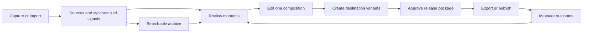

# StriVo Creator Edition: capture-to-publish product report and delivery manifest

Date: 2026-09-07  
Repository examined: `63bdcc420def902512fac3ea7bb2c156985677f9`  
Scope: current implementation, competitive requirements, intended experience, architecture, analytics and visualization, and a dependency-aware delivery manifest. This is a planning and assessment artifact; it does not implement features or change the release hold.

## 1. The product to build

StriVo should become the creator's working memory and production desk: everything they record is searchable, every worthwhile moment can become an edit, every edit can become a destination-specific release, and each release's results can inform the next stream. The strongest opportunity is the continuity between those steps.

The repository contains real substrate for this: a PVR, transcript providers, nondestructive cuts and revisions, media-processing utilities, a ten-stage artifact pipeline, a research evidence store, and analytical transforms. It does **not** yet provide a dependable, contiguous creator product. Several surfaces describe integrations that the main execution path does not deliver. Direct publishing is absent from the inspected implementation. Some analysis is descriptive or heuristic despite audience-performance vocabulary.

The recommended investment order is:

1. Repair the promises already visible in the UI: transcript access, saved effects reaching exports, complete snapshots, and truthful availability.
2. Establish one project, one time model, and one revision-aware render contract across existing components.
3. Ship a complete local recording/import → find moments → edit → caption/reframe → export-package journey.
4. Add dependable publishing to one destination and ingest its measured results.
5. Expand the same flow into live clipping, multiple destinations, archive intelligence, reusable visual storytelling, and small-team review.

The first defensible competitive claim is **“a local, stream-first capture and post-production workspace.”** Full Riverside parity would additionally require remote guest recording. That is outside the existing strategy; the report preserves that boundary and makes the resulting limitation explicit.

The north-star outcome should be **creator-approved, publish-ready outputs per hour of human editing**, paired with time from capture/import to first approved output. Track actual publication separately. Do not optimize for the number of generated clips, plugin count, or an unvalidated “virality” score.

## 2. Evidence and scope boundaries

This assessment traced the Rust workspace, feature gating, PVR substrate, Creator route handlers, ordered SPA modules, EDL models and renderer, artifact DAG, transcript backends, research store, analytical transforms, draft generation, and CI configuration. Breadth inventory is not a claim that every plugin was exhaustively audited. Source inspection is distinguished below from executed tests and proposed behavior.

The worktree was clean when inspection began. The focused command executed was:

```sh
cargo test --locked --offline -p strivo-editor -p strivo-dataviz -p strivo-reuse -p strivo-captions -p strivo-clipper
```

It completed successfully: editor **24**, Data Viz **8**, Reuse **12**, captions **18**, clipper **8**; **70 unit tests passed**, with zero failures and zero doc-tests. The editor tests include failure-path scratch cleanup. This was not a full workspace test, browser session, production benchmark, live capture test, provider evaluation, or real publishing test. No external accounts were connected and no content was posted. Integration findings below are source-traced unless explicitly labeled otherwise.

The current constraints matter:

- [README release boundary](../README.md) says Creator Edition is experimental, unsupported, and unreleased. No supported Creator binary, image, activation, trial, purchase, or licence service exists. [The entitlement implementation](../src/licence/gate.rs) defaults paid capabilities to unavailable and provides a debug-only development override. Compiling Creator is not equivalent to shipping it.
- [ADR 0002](adr/0002-monorepo-boundary.md) supersedes the repository-split proposal. Keep one repository and enforce PVR/Creator boundaries in builds, routes, assets, and background behavior.
- [The existing strategy](STRATEGY-NVIVO-RIVERSIDE.md) explicitly prioritizes local multitrack import, excludes remote guest studio recording, parks cloud collaboration, and rejects subscriptions for locally running code. Those are the baseline assumptions here; historical price points are not current purchase offers.
- [The research roadmap](RESEARCH-PLATFORM-ROADMAP.md) already proposes one evidence kernel and analytical storage. Reuse that foundation without making a creator complete a research workflow to cut a clip.
- Older documents contain stale implementation claims. For example, the previous audit's CSS-split remainder has been overtaken by [the current build script](../crates/strivo-web/build.rs), which assembles both JS and CSS by edition. The generated editor README says zero tests and pure data, while current code includes SQLite, FFmpeg calls, and 24 passing tests. The older strategy's blanket statements about competitors should be treated as hypotheses, not current market facts.

## 3. What exists now

“Implemented” below means code exists and its main responsibility was inspected; it does not imply production readiness. “Partial” means useful components exist but the requested workflow exceeds them. “Planned” means metadata, interface, or roadmap evidence rather than the actual capability.

| Capability family | Current evidence | Assessment and implication |
|---|---|---|
| Capture and archive | [Recording modules](../src/recording), platform adapters, monitoring, scheduling, persistence, catalog pulls, finalization and repair; [PVR overview](../README.md) | Implemented PVR foundation. Preserve it and validate reliability under concurrent creator workloads. Capture of platform output cannot restore pristine camera or audio tracks that were never recorded. |
| Edition and tool composition | [Web Cargo features](../crates/strivo-web/Cargo.toml), [plugin host](../crates/strivo-plugins/src/lib.rs), [asset assembler](../crates/strivo-web/build.rs) | The web Creator feature names 35 optional dependencies. The multistream layout crate is always-on PVR functionality, not a Creator recording studio. |
| Transcription and analysis | [Crunchr](../crates/strivo-plugins/src/crunchr), providers for Whisper CLI, WhisperX and Voxtral, SQLite transcript data, search, analysis, embeddings and cost utilities | Substantial implementation. Provider capabilities, local installation, word alignment, diarization, consent and failures need one visible contract. Presence of a provider adapter does not establish accuracy. |
| Archive intelligence | [Research store](../crates/research/src/lib.rs), [search](../crates/research/src/search.rs), [moments](../crates/research/src/moments.rs), [Archive UI](../crates/strivo-web/assets/spa/017-creator.js) | Projects, sources, signals, provenance, codes/codings, cases, memos, relationships, migrations, search and moments are reusable assets. This is a research project model, not yet the full editing/publishing project model described below. |
| Editing | [Editor crate](../crates/editor/src/lib.rs), [revision store](../crates/editor/src/store.rs), [core EDL](../src/edl/schema.rs), [editor UI](../crates/strivo-web/assets/spa/029-creator.js) | Real split, ripple delete, sequential B-roll insertion, fades, saved revisions and rendering. Multiple EDL representations coexist. The current cuts model is not a layered, synchronized multitrack composition. |
| Transcript edit legacy | [Editor plugin shell](../crates/strivo-plugins/src/editor/mod.rs), word-indexed clips and concatenation helpers | Useful primitives remain from the deleted TUI. A shell registration and word-index model do not establish a modern transcript-editing experience. |
| Audio toolbox | `multitrack`, `loudness`, `deadair`, `vad`, `sidechain`, `automation`, `insert-fx`, `pitch`, `beat-detect`, `submix`, `ab-render` under [crates](../crates) | Track probing/extraction, detectors, filter builders, settings and some execution paths exist. Main-render composition is incomplete. A/B render-quality comparison is not an audience experiment. Source separation has an interface reserved in multitrack, not a demonstrated separation backend. |
| Visual/editorial toolbox | `branding`, `captions`, `scenes`, `broll`, `cuepoints`, `chapters`, `structure`, `thumbnails`, `clipper` | Real building blocks for overlays, subtitle files, snapshots, tagged B-roll suggestions, segmentation and highlight extraction. These do not yet amount to a shared preview and fully rendered composition with editable vertical layouts. Caption translation currently uses an identity translator. |
| Audience and content signals | `chat-density`, `heatmap`, `insights-compare`, `schedule-optimizer`, `viewguard-trend`, plus Insights/Viewguard in the plugin host | Useful descriptive/heuristic analysis. Viewer samples and anomaly signals have persistence. Chat activity, content activity, anomaly scores and measured retention require distinct labels and provenance. |
| Chat and multiview | [Chat routes](../crates/strivo-web/src/routes/chat.rs), [chat primitives](../crates/chat/src/lib.rs), [multistream layouts](../crates/multistream/src/lib.rs) | Twitch reception is browser-side; YouTube rooms are marked non-connectable in the inspected route. Durable daemon-owned chat capture was not found. Multi-stream viewing is not outbound simulcasting or isolated multitrack acquisition. |
| Data visualization | [Six experiments and Series model](../crates/dataviz/src/lib.rs), [SVG UI](../crates/strivo-web/assets/spa/015-creator.js) | Word frequency, speaker time, speaker appearances, episodes per month, speaking-duration ladder and speaker co-occurrence exist. The current UI's transcript-loading contract is broken; see F01. No complete creator-performance dashboard follows from these transforms. |
| Preparation and reuse | [Ten-stage template](../crates/strivo-plugins/src/pipeline_templates.rs), [artifact executors](../crates/strivo-plugins/src/artifacts.rs), `reuse`, `brandsafe`, `casebook` | Real caption/chapter/clip/thumbnail/draft/brief artifacts, stage caching and orchestration. Output preparation starts from the recording; it is not a release of a selected final edit revision. Rule-based brand checks are review assistance. |
| Posting | [Reuse draft model](../crates/reuse/src/lib.rs), [marketplace](../crates/marketplace/src/lib.rs) | Reuse explicitly makes no API calls. `yt-publish` is `EntryPoint::Roadmap`, `installed: false`. Descriptions and draft statuses must not be presented as proof of upload, scheduling or publication. |
| Execution and verification | [Pipeline runtime](../src/pipeline/runtime.rs), [executor](../src/pipeline/executor.rs), [CI](../.github/workflows/ci.yml), [browser tests](../crates/strivo-web/e2e/tests) | Resource locks, retry/cancellation machinery, edition builds and test lanes are meaningful foundations. Existing mocked browser coverage and a real-server lane do not prove the full real-media Creator journey. |

## 4. Findings that should change the build order

### 4.1 Data Viz currently cannot obtain its expected transcripts

At [005-creator.js](../crates/strivo-web/assets/spa/005-creator.js), `API.crunchrTranscript` requests `/plugins/crunchr/transcript/{id}` and catches failures as `null`. The inspected server registers `/api/v1/plugins/crunchr/recordings/{id}` instead; its `crunchr_recording` handler returns `segments`. [The Data Viz UI](../crates/strivo-web/assets/spa/015-creator.js) expects `utterances` and skips missing results.

This is a source-confirmed route and response-shape mismatch, with error masking. A user can have valid transcripts and still be told that none are available. Repair the shared contract and exercise it against the real server before adding charts. Also replace the UI's invented one-second end-time fallback with explicit missing timing.

### 4.2 Saving an effect does not guarantee that the main editor renders it

The `editor_render` handler in [plugins.rs](../crates/strivo-web/src/routes/plugins.rs) loads the saved EDL, branding and volume automation and calls `render_edl_with_filters`. It does not load saved Insert FX, pitch/time, a loudness target, caption styling/content or the submix. Yet [editor controls](../crates/strivo-web/assets/spa/029-creator.js) tell users saved FX and pitch/time will be baked at render.

Other handlers and A/B helpers do build filters; their existence does not connect them to this main render call. This is the most serious current trust gap in the editor. Define a single render plan from the selected revision, make preview and export consume it, and verify the decoded result for each effect and relevant combination.

### 4.3 “Whole session” snapshots are currently narrower than the UI promises

In [plugins.rs](../crates/strivo-web/src/routes/plugins.rs), `read_recording_components` reads branding, automation, captions style and EDL. It does not capture all the settings described by Scenes or the surrounding audio tools. Restoration walks components separately and can partially succeed.

Move to a versioned, complete project revision with validation and atomic activation. A restoration should either activate a coherent revision or explicitly retain the prior one. Historical EDL revisions are valuable and should migrate, not disappear.

### 4.4 The editor's render lifecycle is not the artifact DAG lifecycle

The main editor render awaits `spawn_blocking` inside the HTTP request and uses a stable output filename. [The renderer](../crates/editor/src/lib.rs) uses a common `.edl-temp` directory under the output parent, with per-cut filenames. Cleanup on failure has been fixed and is tested; that does not isolate concurrent renders. Source inspection indicates collision/overwrite risk if requests target the same directory concurrently. This report did not reproduce that race.

Make renders durable jobs with unique scratch spaces and immutable artifact IDs, progress, cancellation, resource admission, crash recovery, output validation and a separate “make current” action. Reuse the existing pipeline runtime rather than inventing another independent task system.

### 4.5 Stream-copy cuts and an ordered cut list are insufficient for an accurate editor

The current renderer stream-copies ordinary subclips, transcodes faded subclips, then concatenates them; it does not visibly normalize every mixed source to a common render specification. Risks include cut accuracy, mixed media compatibility, absent audio, and inconsistent output. These are source-derived risks requiring real-media fixtures, not failures claimed from an executed benchmark.

The model uses `f32` seconds and file paths, and represents B-roll as sequential inserts. Ultimate-editor requirements include layered B-roll over continuing audio, multiple audio/video tracks, track linking, exact timing, transitions, reframing, speed changes and mappings back to source. Extend through a canonical composition model and an explicit migration adapter.

The `editor_save` handler also accepts client-supplied cut paths with only limited EDL compaction. Before broader deployment, validate authorized asset identities, source ranges and allowed media protocols at execution boundaries. This is a hardening finding, not a claim of a demonstrated exploit.

### 4.6 Publish preparation is not publication, and does not follow the approved cut

The ten-stage `creator_publish` template produces artifacts and ends at Casebook. It does not include a user's final edit revision, destination rendering, upload, processing reconciliation, scheduling, remote ID capture or analytics ingestion. Rename its user-facing concept to preparation until those contracts exist.

The necessary bridge is an immutable **release package**: approved composition revision + destination variant + rendered artifact + metadata + approval record. Every publication and metric must refer back to that package. Short-form aspect strings in drafts do not themselves crop or render media.

### 4.7 The audience-data advantage is promising but incomplete

The current chat receive path is a browser WebSocket; `chat_density_compute` accepts a supplied log/CSV and documents that it does not persist data. Do not inherit the older strategy's assertion that every capture already includes durable synchronized chat. Build capture-owned chat and event logs, disconnection coverage, deduplication and clock mappings.

[Insights Compare](../crates/insights-compare/src/lib.rs) explicitly constructs its “retention” proxy from `0.6 × talk + 0.4 × action`, smoothed. It does not observe audience watch behavior. Viewguard anomalies likewise require uncertainty and review, not accusations. These tools should help creators locate events, then be evaluated against measured outcomes when authorized data becomes available.

### 4.8 Studio/Analytics/Publish are organizational shells, not yet a contiguous flow

[PRO_PANES and renderProApp](../crates/strivo-web/assets/spa/021-creator.js) often render a link or instructions to open a recording's Info → EDL controls. Some tabs show an API reference instead of a working tool. This breaks the user's mental model at the exact point the product promises a workspace.

Move the action into the project context. Keep specialized functions discoverable in an inspector or command menu. A creator should see media, transcript, timeline and task status, not plugin slugs, filter strings, JSON inputs or internal pipeline terminology.

### 4.9 Existing tests are useful but do not close the integration gaps

Passing pure transforms can coexist with a nonexistent transcript route or a renderer that ignores saved state. The release gate needs at least one real-server, real-media vertical journey and focused contract tests at each boundary. Do not use historical audit test counts as fresh evidence; this report's executed scope is the 70 tests above.

## 5. Competitive bar, checked against current primary sources

These are documented product capabilities, not hands-on comparative benchmarks. Availability may depend on plans, accounts and deployment. No pricing, quality superiority, or universal competitor absence is inferred.

| Reference | Verified expectations relevant to StriVo | Implication |
|---|---|---|
| Riverside editing | Transcript editing, speaker tracks, timeline control, audio/color adjustments, layouts, overlays and AI-assisted editing are presented as one editor. [Official editor page](https://riverside.com/video-editor) | Match transcript/timeline continuity, understandable controls and dependable preview/export before marketing the toolbox as a competitive editor. |
| Riverside clips | Magic Clips provides automated short-form repurposing. [Official help](https://support.riverside.com/hc/en-us/articles/12124048765981-About-Magic-Clips) | Produce editable, reviewable clips with useful context and destination layouts, not only ranked timestamps. |
| Riverside recording | Local participant recording with separate tracks and high-resolution capture is part of Riverside's proposition. [Official recording comparison](https://riverside.com/riverside-vs-zoom) | Platform-output PVR is a different acquisition mode. Prioritize OBS/local multitrack import; explicitly avoid claiming equivalent remote-studio capture. |
| Descript | Text edits update corresponding media; the workflow includes audio cleanup, captions and export. [Official editor](https://www.descript.com/tools/video-editor) | Transcript correction and media deletion must be distinct operations; transcript, timeline and output should stay aligned. |
| OpusClip | Its calendar advertises creation, editing, multi-platform publishing/scheduling and analytics together. [Official calendar](https://www.opus.pro/calendar) | A calendar and measurable post lifecycle belong in the product. Its pages are not perfectly consistent: the [livestream page](https://www.opus.pro/business/live-streaming) still marks analytics “Coming soon.” Validate actual competitor availability before stronger claims. |
| OBS | Separate recording audio tracks support downstream editing. [Official guide](https://obsproject.com/kb/multiple-audio-track-recording-guide) | Make mic/game/voice-chat/music tracks easy to import, name, synchronize and mix. Preserve the mixed fallback track. |

The differentiation to test with users is the combination of a persistent local archive, live context, cross-recording retrieval, transparent moment suggestions, and performance feedback tied to exact edits. “Everything from one stream in one app” is already a competitive baseline. A stronger claim is “your entire streaming history remains useful in every new production.”

Remote guest recording, browser-local isolated tracks, guest consent, reconnection uploads, device checks, synchronization, echo management and producer controls would be a separate program if the existing non-goal is reversed. Full cloud collaboration and an outbound streaming studio would likewise require explicit product expansion. They are listed as deferred options, not concealed omissions or prerequisites to the local-first release.

## 6. The contiguous experience

Use one creator project as the persistent context. A project can contain several recordings, external assets and many compositions. A channel/workspace contains projects and shared assets. The research kernel's project can be linked through stable IDs; do not silently redefine it as a single recording or force a one-to-one relationship that prevents compilations.



| Step | What the creator sees and does | Continuity requirement |
|---|---|---|
| Start | “Record my channel,” “Import recording,” “Open project.” Choose output goals and a brand template. | One setup screen; distinguish capture credentials, AI-provider configuration and publishing connections. Reuse established preferences. |
| Capture/import | Preview, source health, track labels, storage estimate, elapsed time and progress. Add hotkey/stream-deck markers. | The project exists immediately. Background capture survives closing the browser. Missing tracks or signals are visible. |
| Review moments | Searchable transcript, candidate clips, synchronized chat and signal lanes. See why a moment was suggested, hear context, adjust handles, accept/reject. | Every candidate retains source identity and time span. Search across the archive can add a source to the same composition. |
| Edit | Persistent player, transcript, layered timeline and contextual inspector. Trim text or timeline; correct transcript without changing media; mix sound and add B-roll. | One undo history, one selected revision, autosave and recovery. No forced reimport, reanalysis or page reset when changing tools. |
| Package | Start from the approved edit, derive long-form, vertical, square and audio variants. Adjust captions, facecam/game layout, thumbnail and metadata. | Variants inherit the parent edit, allow explicit overrides, and clearly show when a parent change makes them stale. |
| Review/export/post | Watch the exact final artifact; inspect destination-specific requirements; approve; export or select a connected account and time. | Editing creates drafts. External posting requires a deliberate publish action or an explicitly enabled automation policy. Uploading, processing and published are different states. |
| Learn/reuse | See available retention/engagement results, compare matched outputs, select a meaningful chart range and return to the corresponding edit/source. | Metrics link to remote post, release package and composition revision. Suggestions explain evidence and uncertainty. |

For an initial acceptance scenario, use a representative two-hour stream with mic and game audio, manually marked moments and a transcript. Produce one edited long-form artifact, three individually adjustable vertical clips and an audio export. Correct a subtitle and remove a sensitive interval; all affected outputs must update coherently, and the original source must remain intact. Later repeat with a six-hour interrupted stream and a cross-recording compilation.

The main navigation should center on **Projects, Capture, Library, Calendar and Insights**, with connections/settings outside the creative path. Within a project, use **Moments, Edit, Outputs and Results** as views over the same selection. Research-specific Coding/Query tools remain accessible as an advanced perspective on the same evidence.

The workspace should keep the player visible while panels change; share selections and the playhead across transcript, timeline and charts; support keyboard editing and a command palette; remember layout; and show clear saved/stale/offline/failed states. Preserve [the existing design tokens](../DESIGN.md), but use quiet, opaque working surfaces where glass, glow and gradients reduce timeline or chart legibility. Validate contrast and keyboard use. Responsive review and publishing can arrive before a touch-first precision editor.

## 7. Architecture needed to make the promise reliable

### 7.1 A common project and artifact contract

Extend the existing core/research infrastructure with Creator-owned types behind the edition boundary. Names below are proposed contracts, not assertions that these types already exist.

| Object | Required identity and relationships |
|---|---|
| `Workspace` / `Project` | Owner/access scope, channel/series context, settings, linked research project, source collection and compositions. |
| `SourceAsset` / `Track` | Immutable asset ID, media fingerprint, authorized locator, origin, acquisition/rights metadata, track type, codec, native timebase, source duration and availability. Paths are resolvable locations, not identity. |
| `CaptureSession` / `ClockMap` | Recording parts, event clocks, dropped intervals, offsets/drift, completeness and finalization. Store wall-clock times separately from media time. |
| `TranscriptRevision` / `Signal` / `Moment` | Stable word IDs and timings where supported, speaker identity scope, human corrections, source spans, confidence, provider/model version, rationale and provenance. Preserve current research signals/codings through adapters. |
| `CompositionRevision` | Ordered/layered clips, linked tracks, source spans, transforms, automation, captions, overlays, output profile and parent revision. Complete immutable snapshots or replayable operations with validated materialization. |
| `Variant` / `RenderPlan` / `Artifact` | Parent revision, format overrides, deterministic resolved inputs, renderer/provider versions, content hash, dimensions/duration/streams, QC and dependencies. |
| `ReleasePackage` / `Publication` | Approved artifact and metadata revisions, actor, destination account, schedule/timezone, upload session, remote ID, status/reconciliation history and action log. |
| `MetricObservation` / `ChartSpec` | Provider metric and definition version, scope, unit, denominator, time interval/timezone, availability/coverage, retrieval time, source query/snapshot, transform and visualization configuration. |

Use SQLite as the authority for mutable local work and transactional references, consistent with the current stack. Large immutable signals and analytical materializations can follow the existing roadmap's Arrow/Parquet/DuckDB direction when profiling justifies them. That is a proposed scale path, not a claim they are implemented. Start with indexed, bounded server-side queries. Do not round-trip an entire archive's transcripts through the browser to calculate an aggregate.

### 7.2 One time model

Use integer or rational media timestamps and preserve each stream's timebase. Avoid accumulating edits in floating-point seconds. Every composition produces an output-to-source interval map, including inserted assets, deleted regions, speed changes, gaps and overlaps. Reverse mappings can have multiple results when a source interval is reused.

Captions, chat overlays, waveform selections, detections, annotations and outcome charts must declare whether their coordinates are source time or composition time. Apply transformations through that shared map. An event recorded at wall-clock time is not automatically an exact media timestamp: record offset, drift and uncertainty, particularly through reconnects and variable frame rate.

### 7.3 One rendering contract

Build a validated render plan from the full composition revision. Specify layer order, video transforms, color handling, transition semantics, track routing, audio effects, loudness, captions and container/profile. Use one composition interpreter for preview and final export; where the preview is approximate, label it and offer a rendered preview.

Use proxies, thumbnails and waveform pyramids for interaction; resolve originals for final rendering. Introduce the smallest native composition model that handles the required timeline rather than turning every plugin's JSON into a separate source of truth. Preserve current cut/preset workflows through explicit adapters; unsupported conversions must report what they cannot represent.

Jobs should be persisted before execution. Give each attempt an isolated scratch directory, declared resources, bounded logs, progress, cancel/timeout behavior and an immutable output location. Validate successful output before marking it complete. Cache keys must include asset content identity, transcript/composition revisions, selected settings and tool/model versions. The current artifact cache's file size/mtime fingerprints are a useful optimization, not sufficient semantic invalidation for a versioned editor.

### 7.4 A truthful publishing state machine

Use a lifecycle such as `draft → needs_review → approved → rendering → ready → uploading → processing → scheduled/published`. Also represent `failed`, `cancelled`, `needs_reauthorization`, `unknown_remote_state` and `removed`. Editing an approved draft invalidates its approval; it must not silently alter a scheduled release package.

Persist upload sessions and reconcile ambiguous results before retrying. Do not promise exactly-once external posting when a provider does not support it; combine local idempotency, remote status checks and explicit ambiguous-state recovery. A disconnected account must not erase local drafts or rendered media.

YouTube's upload endpoint requires OAuth and restricts uploads from relevant unverified API projects to private viewing pending audit. Implementing HTTP upload alone does not establish public publishing readiness. [YouTube upload contract](https://developers.google.com/youtube/v3/docs/videos/insert)

TikTok Direct Post has audit restrictions and specific creator-information, privacy and consent requirements. Destination controls must be capability-driven, including account-specific duration limits; do not encode the current Reuse default of 60 seconds as a universal platform rule. [TikTok guidelines](https://developers.tiktok.com/docs/en/content-sharing-guidelines)

Start with YouTube as the recommended first connector because the repo already targets YouTube acquisition and names a future publisher. Treat upload, Analytics authorization and API-project approval as separate work. TikTok and Instagram/Reels are the next short-form candidates. Instagram API documentation could not be fetched during this review (HTTP 429), so current account eligibility and permissions remain a verification task. Podcast, Patreon, blog/newsletter, LinkedIn, Facebook and X integrations should each state whether they support direct posting, hosting integration or a manual package; never infer write access from existing read/capture support.

## 8. Analytics and data visualization as creative tools

There are three different products here: analysis of source content, measurement of published performance, and charts that become content themselves. Build shared provenance and selection primitives, but keep their meanings distinct.

### 8.1 The metric contract

| Metric class | Examples | Required presentation |
|---|---|---|
| Observed capture data | Viewer samples, chat messages, markers, missing intervals | Provider, sample cadence, coverage and gaps; missing is not zero. Browser-visible chat is not proof of complete collection. |
| Derived content signals | Speech activity, scene changes, topic recurrence, heuristic highlight scores | Explain formula/model, inputs, normalization and confidence. Name them “activity” or “suggested moments.” |
| Authorized outcome data | Views, watch time, retention, engagement, impressions/CTR where actually exposed | Native metric definition, account permission, reporting window, freshness, provider constraints and supported breakdowns. Unsupported metrics remain unavailable. |
| Editorial/product outcomes | Time to first export, suggestions accepted, manual editing time, rework and render failure | Clear event definition; local or opt-in collection consistent with product policy. Count approved useful outputs, not all generated artifacts. |
| Experiments | Alternative hooks, caption treatment, length and thumbnails | Assignment/exposure method, sample size, uncertainty and confounders. Separate randomized tests from observational comparisons. |

For example, YouTube's `audienceWatchRatio` can exceed one when portions are replayed. It is not the same quantity as StriVo's normalized activity score. [YouTube metric definitions](https://developers.google.com/youtube/analytics/metrics) Its retention dimension represents 100 equally spaced positions over the published video's duration, so a long video does not yield frame-level outcome measurements. [YouTube retention dimensions](https://developers.google.com/youtube/analytics/dimensions)

Record the denominator before deriving rates. Use duration-weighted calculations where appropriate, explain whether speaker time includes overlapping speech, distinguish recorded duration from speaking duration, and keep unknown speaker identities separate across unrelated recordings. Cross-platform view totals and retention curves are not automatically comparable. Compare matching formats and elapsed time since posting, with timezone and sample-size controls. A chat spike may follow a raid or giveaway rather than content quality; recommendations should expose that context.

### 8.2 Views worth building

| View | Decision it helps make | Interaction that keeps it in the creative flow |
|---|---|---|
| Stream timeline | Which moments deserve review? | Brush aligned chat/viewer/activity/marker lanes; open exact source span as a candidate; show capture gaps. |
| Output retention | Where did the released edit lose or regain attention? | Select a measured interval, inspect coarse sampling, map to the published revision and then the original source. |
| Content comparison | Which topics, formats and hooks appear promising? | Filter comparable cohorts; show distribution and sample size; open examples instead of claiming causality. |
| Production funnel | Where is creator effort wasted? | Source → candidate → accepted → rendered → published; inspect rejection reasons, slow jobs and rework. |
| Calendar and coverage | What is ready, scheduled, published or blocked? | Drag schedules through validated actions; display destination and local timezone; inspect per-account failures. |
| Archive map | Which recurring bits, guests, topics or story arcs can be reused? | Search and linked examples; avoid treating diarization labels as globally resolved people. |
| Insights board | What should this creator change next? | Save filters, pin evidence-backed findings, attach a recommendation to a new project or template. |
| Chart asset editor | How can the creator explain data in the video? | Turn a saved chart/query snapshot into a branded static or animated overlay with citations and an accessible alternative. |

A serious chart grammar needs dimensions and measures, units, explicit scales, legends, uncertainty/coverage, time bucketing, annotations, linked filtering, accessible tables and saved query state. The existing `{label, value}` points are fine for simple bars but not sufficient for multiseries time plots, error bars, scatter data, network relations or source-linked brushing.

Charts used in published content must snapshot their data and visual specification. A later provider correction should mark the chart stale, not silently change a scheduled video. Add CSV/JSON exports and SVG/PNG/PDF outputs where appropriate; animated charts need duration, keyframes, deterministic fonts/layout and frame-stable rendering. Authoring external CSV/JSON data also needs type inference with user correction, timezone/locale handling, join validation and source attribution.

## 9. Delivery manifest

This is the manifest of required work for the proposed scope. Each row is a deliverable, not a claim of completion. Every row has an implementation owner role, dependencies and an observable acceptance bar. “Gap” classifies the present starting point: **Repair** = a traced defect/claim mismatch; **Integrate** = existing pieces need a common workflow; **Extend** = expand an implemented capability; **New** = no complete implementation found; **Validate** = evidence needed before a claim or release.

Milestones: **M0** restore trust; **M1** unified sources/project; **M2** coherent editing; **M3** release/export and first posting; **M4** feedback and live differentiation; **M5** scale and comprehensive polish. A milestone is the intended delivery tranche, not an assertion that every feature must wait until the previous tranche ends. Dependencies, not row order, govern execution. **P0** blocks trust/safety or a coherent first workflow; **P1** is required for the competitive product; **P2** completes the broader vision after the core loop.

Owner roles: **Platform** = persistence/jobs/contracts; **Media** = capture/timeline/render/audio; **UX** = product/design/frontend; **Intelligence** = speech/search/ranking; **Data** = metrics/queries/charts; **Integrations** = platform APIs; **Quality** = security/reliability/accessibility/release. These are responsibilities, not existing staffing assignments.

### Foundation and repairs

| ID | Priority / milestone / gap | Deliverable and owner | Depends on | Acceptance |
|---|---|---|---|---|
| F01 | P0 / M0 / Repair | Fix Data Viz transcript route, envelope and error semantics. Platform + UX. | — | A real-server fixture with a transcript produces the expected series; missing, unauthorized and failed transcript fetches remain distinguishable. |
| F02 | P0 / M0 / Repair | Reconcile saved effects with main render and UI promises. Media. | — | Each exposed render-affecting control either changes the decoded artifact as specified or is clearly unavailable; regression fixtures cover combined effects. |
| F03 | P0 / M0 / Repair | Validate media inputs and isolate render scratch/output. Media + Quality. | — | Reject unauthorized/out-of-range assets and unsafe protocols; concurrent attempts cannot overwrite or clean one another's files; failure preserves prior outputs. |
| F04 | P0 / M1 / Integrate | Canonical creator project, source, composition, variant and artifact IDs. Platform. | — | One project holds multiple recordings and edits; moving source files preserves identity; research links round-trip. |
| F05 | P0 / M0 / Integrate | Typed API/feature-capability contracts and generated or checked client bindings. Platform + UX. | — | Contract tests detect route/envelope drift; supported operations reflect the actual build, entitlement and installed media/provider capabilities. |
| F06 | P0 / M1 / Integrate | Durable job and artifact lifecycle for creator operations. Platform. | F04 | Closing browser/restarting service preserves job status; retry/cancel/progress are observable; completed outputs have valid artifact records. |
| F07 | P0 / M1 / New | Shared media clocks and source/composition interval mapping. Media. | F04 | Trim, repeated clips, speed changes, gaps and overlaps map correctly in both directions using precise timestamps. |
| F08 | P0 / M1 / Integrate | Versioned migrations for EDLs, Scenes, plugin settings, drafts and research links. Platform. | F04, F07 | Previous-version fixtures retain edits and provenance; migration is rehearsed from backup; unsupported state is reported, never silently dropped. |
| F09 | P0 / M0 / Repair | Reconcile docs, UI availability and release boundary. UX + Quality. | — | No planned publisher/translator or incomplete snapshot is described as working; both JS/CSS edition boundaries have current artifact evidence. |
| F10 | P0 / M0 / Validate | Representative, redistributable media and workflow fixture corpus. Quality + Media. | — | Fixtures cover multi-audio, silent video, VFR, mixed codecs, long GOPs, Unicode paths, discontinuities and known visual/audio landmarks. |

### Capture, import and source stewardship

| ID | Priority / milestone / gap | Deliverable and owner | Depends on | Acceptance |
|---|---|---|---|---|
| C01 | P0 / M1 / Extend | Local file/folder import with drag/drop, manifests, deduplication and relinking. Media + UX. | F04, F06 | Import representative video/audio into the same library/project as PVR; duplicates are explained; missing sources can be relinked. |
| C02 | P1 / M1 / Integrate | OBS multitrack onboarding and import. Media + UX. | C01, F07 | Mic/game/voice-chat/music are identified or manually labeled, independently audible, synchronized, and preserved through export. |
| C03 | P1 / M1 / New | Daemon-owned durable chat acquisition and replay. Integrations + Platform. | F04, F07 | Closing the browser does not stop collection; deduplicate messages, track gaps/deletions and reconnect; replay aligns to known capture landmarks. |
| C04 | P1 / M1 / Extend | Synchronized stream events and viewer samples. Integrations + Data. | F04, F07 | Persist supported markers, categories and provider events with source clocks/coverage; unsupported permissions produce an explicit state. |
| C05 | P1 / M4 / New | Growing-media review and live clip extraction. Media + UX. | C03, C04, R01, E03 | A reviewed clip can render from finalized capture segments while recording continues, without corrupting or starving acquisition. |
| C06 | P0 / M1 / Validate | Capture interruptions, segment recovery, disk quotas and workload isolation. Media + Quality. | F06, F10 | A long-stream disconnect/restart/disk-pressure rehearsal preserves playable completed parts and reports missing intervals; rendering cannot silently exhaust capture capacity. |
| C07 | P0 / M1 / New | Source ownership, licence/consent notes and publication eligibility. UX + Platform. | F04 | Personal-archive material and creator-owned/publishable assets are distinguishable; derivatives retain provenance and review requirements. |
| C08 | P1 / M1 / Extend | Ingest preprocessing and readiness checklist. Media + UX. | C01, F06 | Probe media, identify tracks, create proxies/waveforms/thumbs and flag missing tools; a user can edit ready media while optional analysis continues. |

### Transcripts, moments and archive intelligence

| ID | Priority / milestone / gap | Deliverable and owner | Depends on | Acceptance |
|---|---|---|---|---|
| I01 | P0 / M1 / Integrate | Canonical word/segment transcript revisions and provider capabilities. Intelligence + Platform. | F04, F05, F07 | Timed words have stable IDs and provenance; providers without word timing are explicitly degraded; corrections survive reruns. |
| I02 | P1 / M2 / Extend | Speaker correction, glossary, language selection and identity scope. Intelligence + UX. | I01 | Rename/merge/split speaker labels without corrupting timing; cross-recording identity requires confirmation or evidence; glossary improves a measured fixture set. |
| I03 | P1 / M2 / Extend | Multimodal moment ranking and narrative boundaries. Intelligence. | I01, C03, C04 | Combine available speech/chat/visual/manual signals; show rationale, context and uncertainty; compare accepted suggestions with a simple baseline. |
| I04 | P0 / M2 / Integrate | Moment inbox with accept/reject, handles, tags and deduplication. UX. | I01, F07 | Accepting a candidate opens an editable source span; rejection is remembered; overlapping suggestions can be merged or kept deliberately. |
| I05 | P1 / M2 / Integrate | Cross-archive lexical/semantic/temporal retrieval. Intelligence + UX. | I01, F04 | A query returns playable, provenance-linked intervals across recordings and adds selected moments to the active project without reimport. |
| I06 | P1 / M2 / Extend | Creator-guided AI rough cut and metadata drafts. Intelligence + UX. | I04, E01 | A prompt produces an inspectable edit proposal with source-linked choices; applying is undoable and never directly publishes. |
| I07 | P0 / M1 / Integrate | Provider setup, local execution, external processing consent and cost controls. Intelligence + UX. | F05, F06 | Show prerequisites, destination of data, estimated usage and budget before external processing; missing models/keys fail actionably; local mode is testable. |
| I08 | P1 / M4 / Validate | Creator-specific evaluation and feedback datasets. Intelligence + Quality. | I03, I04, A01 | Measure transcript/alignment errors, moment acceptance, harmful context loss and ranking calibration across speech-heavy and visual streams. |

### Editor and creative finishing

| ID | Priority / milestone / gap | Deliverable and owner | Depends on | Acceptance |
|---|---|---|---|---|
| E01 | P0 / M2 / Integrate | Persistent project workspace and selection model. UX + Platform. | F04, F05 | Player, transcript, timeline, inspector and task status coexist; changing tool preserves project, playhead, selection and unsaved work. |
| E02 | P0 / M2 / New | Transcript editing linked to media operations. UX + Media. | E01, I01, F07 | Correct-text mode leaves media intact; delete/reorder words edits the composition; undo and captions remain aligned. |
| E03 | P0 / M2 / Extend | Layered timeline with trim/split/ripple/slip, snapping and track linking. Media + UX. | E01, F07, R02 | Frame/time-accurate manipulation works by mouse and keyboard; linked audio/video stay synchronized; original media remains intact. |
| E04 | P1 / M2 / Integrate | Audio mixer and ordered effect chain. Media + UX. | E03, F02, C02 | Mute/solo/gain/pan, source/master routing, ducking, cleanup, fades and normalization agree with preview and render. |
| E05 | P0 / M2 / Integrate | Captions as revisioned timeline content. Media + UX. | E02, F07 | Edit text/timing/speaker/style; export sidecar and burned-in captions after cuts/speed changes; readable safe-area preview matches render. |
| E06 | P1 / M2 / New | Destination reframing and streamer layouts. Media + UX. | E03 | Editable 16:9/9:16/1:1 layouts support gameplay plus facecam, screen/demo and speaker focus; manual overrides survive regeneration. |
| E07 | P1 / M2 / Extend | Brand assets, titles, lower thirds and intro/outro templates. UX + Media. | E03, C07 | Reusable fonts/colors/logos/music and safe areas apply across variants; missing assets and terms are surfaced before export. |
| E08 | P1 / M2 / Extend | Layered B-roll, images, transitions, zoom/crop and basic color. Media + UX. | E03, E07 | Insert B-roll over continuing source audio; adjust transform/keyframes; mixed source sizes/rates produce expected output. |
| E09 | P0 / M2 / Repair | Complete undo/redo, autosave, revision branching and snapshots. Platform + UX. | F08, E01 | Reload/recover/restore reproduces all edit-affecting state; concurrent saves detect conflicts; invalid restore leaves current state unchanged. |
| E10 | P1 / M3 / New | Review comments, range notes and approval workflow. UX + Platform. | E09, C07 | A local reviewer can attach notes to the exact revision/range; changing an approved revision invalidates approval; sharing never exposes raw credentials. |
| E11 | P2 / M5 / Extend | Translation, optional speech separation and correction aids. Intelligence + Media. | I07, E05 | Each enabled backend is evaluated and labelled; translated timings remain editable; synthetic/separated audio is distinguished from captured stems. |
| E12 | P1 / M3 / Integrate | Keyboard-first usability, accessible timeline and responsive review. UX + Quality. | E01, E05 | A creator completes select/edit/caption/export using keyboard; controls expose names/state; review works on a narrow screen with reduced motion. |

### Rendering, exports and media portability

| ID | Priority / milestone / gap | Deliverable and owner | Depends on | Acceptance |
|---|---|---|---|---|
| R01 | P0 / M2 / Integrate | Single revision-to-render-plan compiler and durable execution. Media + Platform. | F02, F03, F06, F07 | Every active track/effect resolves into the plan; preview/render discrepancies are tested; restart and cancellation preserve coherent job state. |
| R02 | P0 / M1 / New | Proxies, waveform pyramids, filmstrips and bounded preview caching. Media. | C08, F07 | Long-media navigation does not decode the entire source; proxy/original mapping is correct; caches rebuild after source changes. |
| R03 | P0 / M3 / New | Immutable output variants and stale-dependency tracking. Platform + UX. | E09, R01 | Parent changes mark affected variants/artifacts stale; manual overrides are explicit; approved releases retain their original revision. |
| R04 | P0 / M3 / Extend | Validated export profiles and batch queue. Media + UX. | R01, R03 | Render tested MP4/video, audio and subtitle packages with correct dimensions/streams/duration; batch progress/errors are per artifact. |
| R05 | P0 / M3 / Validate | Final media QC and review player. Media + Quality. | R04, F10 | Detect missing streams, unexpected duration, black/silent faults, clipped audio and caption overflow; review plays the exact artifact selected for release. |
| R06 | P1 / M3 / Extend | Portable project/media packages and professional-editor interchange. Media + Platform. | F08, R03 | Export/import a supported subset with sources, edit/caption state and attribution; unsupported transforms are reported with a rendered fallback. |
| R07 | P1 / M4 / Extend | Resource-aware acceleration, cache invalidation and long-job recovery. Media + Platform. | R01, R04 | Compare CPU/GPU output and throughput on declared hardware; memory/disk/concurrency budgets hold while PVR records; stale cache never masquerades as current output. |

### Publishing and distribution

| ID | Priority / milestone / gap | Deliverable and owner | Depends on | Acceptance |
|---|---|---|---|---|
| P01 | P0 / M3 / New | Release package and publication state machine. Platform. | R03, R05, E10 | Approved artifact/metadata/account are immutable inputs; failed or ambiguous remote actions retain recoverable state and an action log. |
| P02 | P0 / M3 / New | Publishing connection vault and destination capabilities. Integrations + Quality. | F05, C07 | OAuth/refresh/revoke work for a test account; secrets are protected; unsupported permissions, formats and account capabilities are explicit. |
| P03 | P0 / M3 / New | First real connector: YouTube upload and reconciliation. Integrations. | P01, P02 | Upload intended artifact, persist remote ID, observe processing/privacy state, handle reconnect/retry, and prove no duplicate after an ambiguous response rehearsal. |
| P04 | P1 / M3 / Integrate | Metadata, thumbnail, captions, chapters and disclosures editor. UX + Integrations. | E05, R04, P02 | Destination preview validates applicable fields and accessibility; approved metadata is versioned; unsupported attachments remain downloadable. |
| P05 | P1 / M3 / New | Calendar, schedule execution and missed-time recovery. Integrations + UX. | P01, P03 | Correct account and timezone are visible; DST changes and offline host behavior are specified; native scheduling is used where supported. |
| P06 | P1 / M4 / New | TikTok and Instagram/Reels connector programs. Integrations + Quality. | P01, P02, P04 | Verify current API eligibility, audits and user-control requirements; expose actual direct-post/upload/manual capabilities and remote states. |
| P07 | P2 / M5 / New | Podcast/hosting, Patreon, blog/newsletter and additional social destinations. Integrations. | P01, P02, P04 | Each connector passes its own contract test; manual package fallback is labelled; read access is never mistaken for publish authority. |
| P08 | P0 / M3 / Extend | Excellent manual publishing package. UX + Media. | R04, P04 | Download media, captions, thumbnail, copy, chapters and provenance together; mark manually posted content with an optional remote link for later results. |
| P09 | P1 / M4 / New | Batch operations, policy-controlled automation and post maintenance. Integrations + UX. | P03, P05 | Preview targets before action; retries and metadata updates are accountable; removal/replacement limitations are explicit; drafts never auto-post by default. |

### Analytics and feedback

| ID | Priority / milestone / gap | Deliverable and owner | Depends on | Acceptance |
|---|---|---|---|---|
| A01 | P0 / M1 / Integrate | Metric dictionary, observation schema, freshness and provenance. Data. | F04, F05 | Each metric has unit/scope/denominator/source/coverage; observed, derived and predicted values cannot be confused. |
| A02 | P0 / M1 / Repair | Rename and explain proxy/anomaly/scheduling outputs. Data + UX. | A01 | Activity is not labelled measured retention; anomaly UI states limitations; missing chat/viewer data is not silently zero-filled. |
| A03 | P1 / M4 / New | Authorized outcome ingestion, starting with YouTube Analytics. Integrations + Data. | P03, A01 | Persist supported metrics against remote post and release revision; show authorization gaps, delay, corrections and provider-specific limits. |
| A04 | P1 / M4 / New | Linked source/composition/outcome timeline. Data + UX. | A03, F07, V02 | A measured retention interval opens the corresponding published revision/source spans, respecting sampling resolution and repeated footage. |
| A05 | P1 / M4 / Extend | Comparable cohorts and creator performance dashboards. Data + UX. | A01, A03 | Compare format/topic/length/age-matched posts with sample counts; provider-native definitions remain inspectable; cross-platform sums are qualified. |
| A06 | P1 / M4 / New | Creator production funnel and effort analytics. Data + UX. | F06, I04, P01 | Explain where candidates are rejected, time is spent and failures occur; opt-in or local collection is explicit and reset/export works. |
| A07 | P2 / M5 / Extend | Outcome-informed recommendations and experiments. Intelligence + Data. | A05, I08 | Recommendations show evidence and counterexamples; no unsupported causal/viral guarantee; experiment setup distinguishes random assignment from observation. |
| A08 | P1 / M4 / Extend | Calendar recommendations with measured support and cold-start handling. Data. | A03, P05 | Compare supported historical slots with a baseline; show sample size/timezone/confounders; low-data accounts receive “insufficient evidence.” |

### Data visualization and data-driven content

| ID | Priority / milestone / gap | Deliverable and owner | Depends on | Acceptance |
|---|---|---|---|---|
| V01 | P1 / M2 / Extend | Saved server-side analytical queries and richer chart series. Data. | F01, A01 | Aggregate a saved source selection without sending all transcripts through the browser; include units, dimensions, series IDs and query provenance. |
| V02 | P1 / M4 / New | Linked brushing, filtering, evidence links and chart annotations. Data + UX. | V01, F07 | Selecting a chart interval selects the same media/evidence; filters persist across views; gaps/uncertainty and accessible tables are available. |
| V03 | P1 / M4 / New | Reusable creator dashboards and insights boards. UX + Data. | V02, A05 | Save/pin/share a local board with named filters and evidence; empty/partial/stale data states remain clear. |
| V04 | P1 / M4 / New | External dataset import and transforms for visual stories. Data + UX. | V01, C07 | Import CSV/JSON, correct types/units/timezones, validate joins and retain attribution; unsafe content is treated as data. |
| V05 | P1 / M4 / New | Branded static and animated chart assets in compositions. Media + Data + UX. | V02, V04, E08, R03 | A chart becomes an editable overlay backed by a frozen query/data snapshot; frame-stable render matches preview and retains citation text. |
| V06 | P1 / M4 / Extend | Reproducible data/figure exports. Data + Quality. | V01, V05 | Export CSV/JSON and supported SVG/PNG/PDF with units, filters, snapshot/version and accessibility notes; reopening reproduces the figure. |

### Operations, quality and product readiness

| ID | Priority / milestone / gap | Deliverable and owner | Depends on | Acceptance |
|---|---|---|---|---|
| O01 | P0 / M1 / Integrate | Backup/restore, retention and derivative-aware cleanup. Platform + Quality. | F04, F08 | Restore projects and source links from backup; deleting disposable proxies does not delete originals; referenced assets are protected or explicitly resolved. |
| O02 | P0 / M3 / Validate | Security, privacy, source/asset dependency review and account isolation. Quality. | C07, I07, P02 | Audit routes/jobs/imports, tokens, external processing and render inputs; retain required notices/provenance; unresolved materials are excluded from release. |
| O03 | P0 / M2 / Validate | Real-server, real-media Creator contract and journey coverage. Quality. | F10, E02, E05, R01 | Test capture/import → moments → edit → revision recovery → actual rendered outputs; fail on missing routes, ignored settings and edition leaks. |
| O04 | P1 / M3 / Validate | Performance, accessibility and cross-platform qualification. Quality + Media. | E12, R04 | Record hardware/browser/tool versions; meet agreed interaction/media budgets on supported systems; capture/render soak tests include contention. |
| O05 | P1 / M3 / New | Onboarding, capability doctor and actionable diagnostics. UX + Platform. | F05, I07, P02 | New installation reaches first useful export; missing tools/providers/accounts show the exact next step; support bundles redact secrets. |
| O06 | P1 / M5 / New | Optional small-team roles and review sharing. Platform + UX. | E10, O02 | Explicit viewer/editor/publisher permissions and revision-safe comments work in the chosen local/private deployment; hosted collaboration remains a separate decision. |
| O07 | P0 / M3 / Validate | Creator packaging, entitlement design and release-hold review. Quality + product owner. | O02, O03, O04, O05, P08 | Approved release policy and verified installers/docs/support exist; no debug unlock ships as commercial authorization; PVR remains independently valid. |
| O08 | P1 / M4 / Validate | Creator field validation and prioritization evidence. UX + product owner. | O03, P08 | Observe five creators using their own archives, log abandonment/rework, and demonstrate repeated useful outputs before expanding speculative features. |

## 10. Delivery gates and the smallest convincing release

The manifest contains **76 deliverables**. It is a target inventory, not a suggestion to launch 76 simultaneous workstreams. Choose complete user outcomes and keep the owner role accountable for the dependency chain.

| Gate | What must be demonstrably true | What can still be limited |
|---|---|---|
| M0: trustworthy prototype | Data Viz uses the actual transcript contract; saved effects are faithfully applied or unavailable; renders isolate attempts; current docs state real availability. | Existing modal editor and narrow formats may remain during repair. |
| M1: unified project | PVR/imported assets, track IDs, clocks, transcript revisions, source provenance, jobs and recovery belong to one coherent project. | Advanced AI and multi-destination posting are unnecessary. |
| M2: usable editor | A creator finds moments, edits transcript/timeline, mixes available tracks, captions/reframes and reloads a complete revision; actual media rendering is covered. | Simple transitions and a small template set are enough; precision and coherence are not optional. |
| M3: completed production loop | Approved destination artifacts and manual packages work; one real posting connector reconciles remote status; release criteria are reviewed. | Start with one publishing provider and a declared format/hardware support matrix. Public posting is conditional on API-project approval. |
| M4: stream-first differentiation | Capture-owned live context, live clips, cross-archive retrieval, measured outcomes and linked visual analysis improve the next edit. | Provider-specific analytics coverage stays explicit; not every platform will expose the same metrics. |
| M5: comprehensive product | Additional distribution, evaluated advanced AI, project interchange, optional small-team use and large-library operation meet demonstrated demand. | Remote guest studio and cloud SaaS remain outside baseline scope. |

The first release candidate should complete the two-hour-source scenario in section 6 against actual media, then recover from a service restart and reproduce the same approved outputs. Publishing credentials or platform audits must not prevent completing and testing the local editing/export product. Equally, a successful local export must not be marketed as direct publishing.

The critical path is **project identity → precise time mapping → complete composition revision → common render plan → validated artifact → approved release package → publishing reconciliation → outcome mapping**. The transcript/preview path is a second dependency chain: **ingest readiness → timed transcript → synchronized editor → caption/reframe variants**. Start provider approval work early because that lead time is external to the renderer team.

A practical first planning tranche is F01–F03, F05, F09–F10, followed by F04/F06/F07 and a C01 → I01 → E01/E02 → R01 vertical slice. Reuse current research IDs, pipeline machinery and revision storage wherever their contracts fit. Do not wait for the entire research roadmap or build more standalone plugin cards before the first coherent project journey works.

## 11. Verification targets and resourcing assumptions

These are proposed acceptance budgets to measure and revise, not performance results from this audit:

| Area | Proposed initial target and measurement condition |
|---|---|
| Interaction | Common local edit commands acknowledge within 100 ms at p95; they must not wait for transcription or final rendering. Measure on a declared baseline machine. |
| Proxy seeking | Seek-to-playable-preview within 500 ms at p95 on a warm local 1080p proxy; separately report cold-cache/network-source behavior. |
| Timing | Known visual cuts land within one output frame; known audio/video sync landmarks remain within 20 ms on supported fixtures, including a long recording. |
| Recovery | No loss of acknowledged saved edits; document unsaved debounce window, interrupt at representative stages, restart, and verify revision/job recovery. |
| Capture isolation | A six-hour concurrent capture/edit/render soak has no unreported gaps or resource starvation; failures retain completed media. |
| Scale | Exercise a six-hour source, a 100-hour active project and a metadata/search library representing 10,000 hours. Set latency/memory budgets from a measured baseline; do not preload all transcripts. |
| Export correctness | Every enabled effect has an observable fixture; composed effects, silent/video-only input, mixed rates/codecs, speed changes and caption mapping pass decoded-media checks. |
| Publishing | Rehearse token expiry, interrupted upload, lost response, provider processing failure, timezone/DST and offline scheduler; reconcile uncertain remote state. |
| Usability | Five creators complete the first-source → approved-output task without engineer intervention; record time, errors and rework, then repeat after revisions. |

The team needs accountable coverage for product/design, frontend editing, media engineering, Rust/platform persistence, integrations, data/intelligence and quality. These can overlap in a small team, but the work does not disappear because one person owns several roles. No calendar estimate is defensible from repository inspection alone: measure the project/render vertical slice, identify available staffing and hardware, and then estimate remaining work. New acquisition infrastructure, professional-editor interchange and API approvals carry especially uncertain effort.

Avoid early commitments to a new frontend framework, a microservice fleet or a second repository. The current SPA needs stronger modules/contracts and a coherent state model; that does not by itself require a rewrite. The existing FFmpeg boundary, provider adapters, SQLite storage and pipeline runtime are assets. Evaluate replacement libraries or services against an actual requirement, benchmark and distribution terms before adopting them; this report does not clear any new dependency for shipping.

## 12. Decisions and deferred scope

The following are recommended defaults for execution, derived from the current strategy and the requested creator-first direction:

- Primary persona: a solo streamer or small production team turning owned/authorized live and recorded material into repeatable releases. Research power is available through creator language and optional advanced views.
- Deployment: local/self-hosted, with optional explicitly configured external AI and platform APIs. Offline editing/export remains valuable independently of external services.
- Acquisition: PVR plus first-class OBS/local multitrack import. Basic integrations with external recorders can expand this without making StriVo a remote studio.
- First publishing destination: YouTube, with excellent export-package fallback and later short-form connectors. Verify account/API eligibility before promising public or scheduled posting.
- Product boundary: one project across preparation, editing, outputs and results; one evidence model behind creator/research vocabulary; no separate silos for “analytics data” and “clip evidence.”
- Commercial boundary: preserve the current release hold until the release program passes review. Historical one-time pricing and a future marketplace are not substitutes for a secure, supported product.

Deferred options that would require a separate scope decision are remote guest recording; cloud rendering and real-time collaborative editing; outbound RTMP/SRT simulcasting/control-room production; live replay/broadcast switching; a full professional color/VFX/DAW replacement; a general research/statistics platform unrelated to creator work; and a public third-party plugin marketplace. Basic portability, quality, access controls and citations remain in scope without committing to those larger products.

The product is ready to be called competitive when a creator can enter with a stream, leave with deliberate published or publish-ready work, and return to results that reliably point back to the exact creative decisions. That continuity is the standard every new feature should strengthen.

## 13. GitHub prior-art sweep — follow-up charter

Review date: 2026-09-07. PAPER tier: **Standard**, for discovery and conditional integration recommendations; no third-party implementation is incorporated by this review.

Objective: identify existing components that can satisfy the manifest through adoption, adaptation, interoperability or independently specified behavior, minimizing new infrastructure.

Search frame: (1) nonlinear/timeline/transcript editing, media decoding, preview/render and interchange; (2) OBS/capture/chat, VAD/ASR/alignment, scene detection and highlight generation; (3) OAuth, resumable uploads, publishing/scheduling and reconciliation; (4) analytical storage, linked charts, animated figures and provenance. Search synonyms include NLE, EDL, WebCodecs, video editor, auto-editor, clipper, forced alignment, Twitch chat downloader, social scheduler, OLAP and visualization grammar.

Target model: current repository declares MIT. Primary deployment is local/self-hosted, including source and packaged binaries/containers. Recommendations also identify constraints on possible proprietary commercial distribution; no proprietary relicensing decision is presumed. No claim of patent clearance or legal approval is made.

Search stopping rule: find credible choices for each area and a short, actionable evaluation queue, with actual license/maturity evidence and fallback options. Study public documentation and license files first. Preserve source-exposure records; no work from this shared session is to be called clean-room implementation. Exact protocol/interchange compatibility matters where needed; copying a competitor's internal architecture or presentation is not a requirement.
